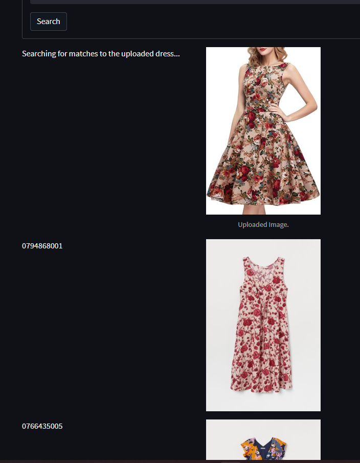

# H&M Dress Finder App: Recommender Systems and Search Engine Matching

We provide <a href='https://github.com/hermanyu/hm-recommender-app'> a streamlit application </a> implementing the ideas and techniques discussed in this project.  

 

**Data Source:** The data used for this project was part of a <a href='https://www.kaggle.com/competitions/h-and-m-personalized-fashion-recommendations'> Kaggle competition </a> hosted by the clothing company H&M.

---

 

# Problem Statement

Recommender Systems sit at the crossroads of marketing/SEO, front-end development, back-end data management, UI/UX, and data science/machine learning theory. In this project, we shall tackle the problem of generating user recommendations from the perspective of Search Engine querying. Concretely, this project explores and implements the following 5 ideas:
1. Popularity based recommendations. For example: Netflix's Top 10 Today.
2. Co-occurrence based recommendations. For example: Amazon's "Users who bought this also bought..."
3. Text-based feature querying. For example: Google/Amazon search bar.
4. Image-based feature querying. For example: Google Image Search.

We implement each of these ideas via a streamlit application which can be <a href='https://github.com/hermanyu/hm-recommender-app'> found here </a>. Since recommender systems are primarily client-facing, we demonstrate how each of these ideas can be deployed on a barebones webpage mimicing an e-commerce setting.

--- 

# Background

The source data for this project was obtained from <a href='https://www.kaggle.com/competitions/h-and-m-personalized-fashion-recommendations'> this Kaggle competition hosted by H&M </a>. Amongst the source files included were:
1. A table of transactions with column values user id, article id, and time. The transactions span approximately 2 years from 2018 to 2020.
2. A table of each clothing article and their metadata including department name, index group name, and product descriptions.
3. A collection of product images for almost all of the items appearing in the transaction.

The only user-item interactions included in the data are the transactions. Thus user-item interactions are binary: 1 if the user bought an item, 0 otherwise. In particular, we cannot distinguish between the following 2 scenarios:
1. A user saw a given item, but did not like it enough to buy it.
2. A user did not see a given item, therefore did not buy it.

This presented a challenge for us in the sense that traditional collaborative filtering methods are best suited for user-item interactions which span a range of values, e.g. IMDB movie ratins 1-5, Amazon product scores 1-5 stars, Apple App Store ratings 1-5, etc. 

Since we cannot distinguish between "user did not like the item" versus "user did not see the item", this makes it very challenging to evaluate any machine learning models we build. For example, let's suppose we tried to build a machine learning model which tries to make the following prediction: Given user U and item I, what is the probability user U would buy item I?
In order to train such a model, we would need to provide the machine 3 things:
1. A class of positive examples (a set of (user, item) pairs where the user bought the item).
2. A class of negative examples (a set of (user, item) pairs where the user saw the item but did not buy the item).
3. A class of "missing" examples (a set of (user, item) pairs where the users never saw the item).

The machine would then train on the data from 1 and 2, then uses the results to make predictions on 3. We can evaluate how well the machine is doing by setting aside a validation set consisting of a mix of examples from 1 and 2, and seeing how accurately the machine is able to predict on this validation set.

Notice that such an approach is not feasible for us: our data does not distinguish between 2 and 3 mentioned above. 

So what do we do? Since we do not have a way to evaluate a supervised machine learning model, we take an alternative perspective and build recommender systems which recommend based on item-item similarities.

---

 

# Recommender Systems

For the purposes of this project, we shall make the following definition:

A **recommender system** is a non-negative real-valued function $S(x,y)$ for all possible pairs $x$ and $y$ where
- $x$ is some user-specific data (e.g. most recent item purchase, a text-based query term, etc.)
- $y$ is any item in our invetory. 

We shall call the function $S$ a **similarity** function. The idea is that a similarity function $S(x,y)$ returns how similar an item $y$ is to some specified input data $x$. We can then make a recommendation to the user by finding the $y$ which maximizes $S(x,y)$ and returning item $y$ to the user.

The 4 main examples we consider in this project are the following:

### 1) Popularity Based Recommender

In this recommender system:
- $x$ is the date-time for which the user is shopping on the site.
- $S(x,y)$ is the number of units of item $y$ that has been sold, for the most recent time period preceeding $x$.

Functionally, this recommender system returns the "Greatest Hits" amongst items in our inventory.

For example, we can recreate Netflix's "Today's Top 10" by specifying S(x,y) to be the number of units of item y sold over the last 24 hours. Here is an example of how such a recommender system might look on the front-end.

    

 

### 2) Co-Occurrence Based Recommender

Given two items x and y, we define the **co-occurrence** between item x and item y as the number of times a single user has purchased both item x and y in the same week. Note that the time period of 1 week is a hyperparameter that we can change to adjust the nature of the recommendations returned.

To make a recommender system out of this:
- Let $x$ be the most recent item a user has purchased (or has in their cart).
- Let $S(x,y)$ be the co-occurrence between item x and item y.

This recommender system essentially groups products together by how often two items are purchased together.

For example, we can recreate Amazon's "Frequently Bought Together" feature using such a recommender.

    

 

### 3) Text-Based Recommender

Let $t$ be a sentence and define $B(t)$ as the Sentence-BERT embedding of the sentence $t$ into a 385-dimensional latent vector.

We can then build a recommender system as follows:
- Let $x$ denote a text-based query term inputted by the user.
- Let $S(x,y)$ is the cosine similarity between the vectors $B(x)$ and $B(y)$.

Functionally, the user tells the system what they are looking for, e.g. "I want a summer dress with thin straps". The system then compares this search term against the product descriptions for each item in our inventory and returns the items with the most similar product descriptions.

    

### 4) Image-Based Recommender (aka The Dress Finder App)

For any image $I$, let $V(I)$ be the VGG-16 vector embedding of the image I. Since we have images for almost every item in our inventory, we shall use $y$ to refer to both item $y$ and the image of item $y$.

We can then build a recommender system as follows:
- Let $x$ denote an image specified by the user.
- Let $S(x,y)$ denote the cosine similarity of the latent vectors $V(x)$ and $V(y)$.

Functionally, this works as a Google Image Search, but for H&M Dresses. Specifically, the user uploads an image of a dress they like and the system finds the dresses which are most similar to the uploaded dress. 

    
    

---

# Conclusion and Remarks

- At the moment, the Dress Finder App queries 5000+ dresses, each encoded as a 38,000-dimensional latent vector. Needless to say the program takes awhile to run (approx. 3 mins on an RTX 3090 and nearly 6 mins when hosted on Streamlit Cloud). This mostly likely implies that creating a production-level version of this application would require a significant invenstment in server/compute power.

- The co-occurrence recommender operates by computing the co-occurrences between each product and storing them in a matrix. Since we are measuring weekly co-occurences, the matrix only needs to be updated weekly. This makes it the most feasible to deploy on a web-server.

- Both the text-based recommender and image-based recommender are built using pre-trained models (S-BERT and VGG16 respectively). One might be tempted to train personalized models from scratch but this is a highly non-trivial task. Training an S-Bert model from scratch would require scraping hundres of billions of product descriptions. Training an image-based model might be more tractable but would also require a non-trivial time and resource investment. 

- Finally, our recommender systems were built specifically to circumvent the problem of binary user-item interactions. If we were able to obtain actual product ratings by users, we can create algorithms which make much more personalized recommendations to each user. This might be an incentive to add a rating/review system per product page on the front-end of the store sight.